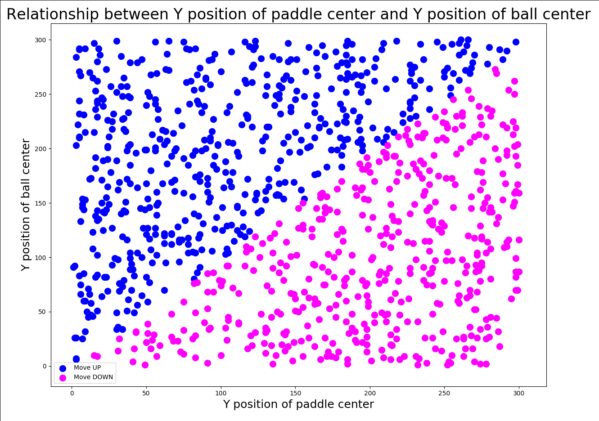

# Machine Learning introduction with Pong

Generally speaking machine learning is about building programs with tunable parameters that are adjusted automatically so as to improve their behavior by adapting to previously seen data.

## 0. Simple AI

The following snippet shows how a simple AI might look like:

> computer.py

```python
class Computer:

    def move(self, paddle, ball):
        paddle_center = paddle.y + paddle.height / 2
        ball_center = ball.position[1] + ball.height / 2

        distance = abs(paddle_center - ball_center)

        if distance > 20 and paddle_center > ball_center:
            paddle.move_up()

        if distance > 20 and paddle_center < ball_center:
            paddle.move_down()

```

As you can see, there is no need for machine learning as the problem is simple enough to hardcode the behavior:

* If the center of the paddle is below the center of the ball, move the paddle up.
* If the center of the paddle is above the center of the ball, move the paddle down.

That is already working fine. However now imagine that it is not that trivial to see this behavior right away. You just have some sample data and know how a player should behave in those situations.

Machine learning can now be used to learn from that data and predict future actions based on observations. This guide will explain the implementation that you can see in `computer_sklearn.py`.

## 1. scikit-learn

Python as lots of modules connected to the topic of AI and machine learning, however scikit-learn is the most famous machine learning library and offers you a lot of different options:

* Classification: Identifying to which category an object belongs to.
* Regression: Predicting a continuous-valued attribute associated with an object.
* Clustering: Automatic grouping of similar objects into sets.
* Dimensionality reduction: Reducing the number of random variables to consider.
* Model selection: Comparing, validating and choosing parameters and models.
* Preprocessing: Feature extraction and normalization.

As we want to use this library for our AI implementation, just add it via Poetry:

```python
poetry add sklearn
```

## 2. Linear Regression / Logistic Regression

Linear regression models are used to show or predict the relationship between two variables or factors.

In our case, we have the y position of the paddle center and the y position of the ball as variables and we want to know if the paddle should move up or down.

Logistic regression on the other hand is used when the dependent variable is binary in nature. That means when our prediction can only be 0 or 1, like in our case!

## 3. Training data

What we are about todo is supervised learning. That means we have training data that we use to train the model so that it can predict future values.

Training data in our case means: we have 2 dimensional tuples that represent the features:

* Center of the paddle on the Y axis.
* Center of the ball on the Y axis.

The other part of the training data are the target values, so in those particular cases did the paddle move up (0) or down (1).

Using `scikit-learn` we can train a Logistic Regression model like this:

```python
from sklearn.linear_model import LogisticRegression


class Computer:

    def __init__(self):
        # features: y position of paddle center, y position of ball center
        training_data = [[50, 150], [400, 200], [100, 110], [210, 190]]

        # 0 = move up, 1 = move down
        target_values = [1, 0, 1, 0]

        self.model = LogisticRegression()
        self.model.fit(training_data, target_values)

```

## 4. Predict actions

Now that we have a trained model, we can use it to predict actions based on new observations:

```python
    def move(self, paddle, ball):
        paddle_center = paddle.y + paddle.height / 2
        ball_center = ball.position[1] + ball.height / 2

        prediction = self.model.predict([[paddle_center, ball_center]])
        print('input: [{}, {}], prediction: {}'.format(paddle_center, ball_center, prediction))

        if prediction == 0:
            paddle.move_up()

        if prediction == 1:
            paddle.move_down()

```

The resulting AI (`computer_sklearn.py`) is acting similar to the hardcoded behavior in `computer.py`.

## 6. More theory and data visualization

Even though the AI is already working, let us have a closer look to get a better understanding of what happens under the hood.

Short recap: Our training data has two features: the y position of the paddle center and the y position of the ball center. The target value is either 0 or 1 whereas 0 means: move the paddle up and 1 means: move the paddle down.

We trained a logistic regression model so that it is able to predict the action (0 or 1) for new input tuples (i.e. paddle and ball positions).

In order to demystify this process, I added a simple visualization. If you want to try it on your own, just go to `computer_sklearn.py` and uncomment the following line:

```python
self._visualize_data_relationship()
```

When you now start the application, you will see the following graph:



These are 1000 predictions of the model for random paddle and ball positions. Blue dots indicate that the model predicted to move the paddle up and magenta dots indicate that the model predicted to move the paddle down.

As you can see, our model found a way to clearly separate those 2 clusters: whenever the y position of the ball position is bigger than the y position of the paddle, the model predicts: move up. Otherwise it predicts: move down.

So our model found a function, that is giving us this result.

However keep in mind: we are doing a logistic regression, that means we either get 0 or 1 as an output. This is usually done by applying a sigmoid function to the output of the underlying function of the model.


As you can see, the sigmoid function returns 0 for smaller values and 1 for higher values. That means our model found a function that behaves in a way so that the result very low when the position value of the paddle is lower than the position value of the ball. Likewise this function returns a very high value, when the position value of the paddle is higher than the position value of the ball.

The good thing is: we can even get this function from our model to get a better understanding how it looks like.

To do this, we can just use the following snippet after training our model:

```python
self.model = LogisticRegression()
self.model.fit(training_data, target_values)

# prediction function used for linear regression
print('f(paddle_center, ball_center) = {} + {} * paddle_center + {} * ball_center'.format(
    round(self.model.intercept_[0], 4),
    round(self.model.coef_[0][0], 4),
    round(self.model.coef_[0][1], 4)
))
```

Which will give us the following output:

```python
f(paddle_center, ball_center) = 0.0124 + -0.2783 * paddle_center + 0.2853 * ball_center
```

This is a simple function and we can even try it on our own with some data.

Let us assume our paddle is at position 10 and the ball is at position 200. That means our paddle is above the ball and to get it, we need to move down. So what we expect is that the function returns a high value so that the sigmoid function turns it into a 1 which means: move down.

```
paddle_center = 10
ball_center = 200

0.0124 - 0.2783 * 10 + 0.2853 * 200 = 54.2894
sigmoid(54.2894) = 1 = down
```

Now let us turn it around. Our paddle is at position 400 and the ball is at position 30. So we would need to move up.

```
paddle_center = 400
ball_center = 30

0.0124 - 0.2783 * 400 + 0.2853 * 30 = -102.7486
sigmoid(-102.7486) = 0 = up
```

As you can see: it works :-) and this is what our model is doing all day long when we play the game.

## 5. Fin

Using machine learning in this case does not really make sense but it is a good and simple example to understand the basics and how to implement a simple model.

You can switch between the hardcoded and machine learning AI by just changing the import statement in `game.py`.

I hope this guide motivates you to look deeper into this topic. A good start is to go for another game and start from the scratch: implement the game logic and then use a machine learning model to create an AI.

To get some more inspiration: check out my FlapAI project on Github which is basically a Flappy Bird clone in JavaScript combined with an AI implementation.

The AI combines Neural Networks using TensorFlow.js (https://www.tensorflow.org/js) with evolutionary algorithms to evolve populations of AI players using genetic operators.

See: https://github.com/prenomenon/flapai

Have fun and good luck :-).
