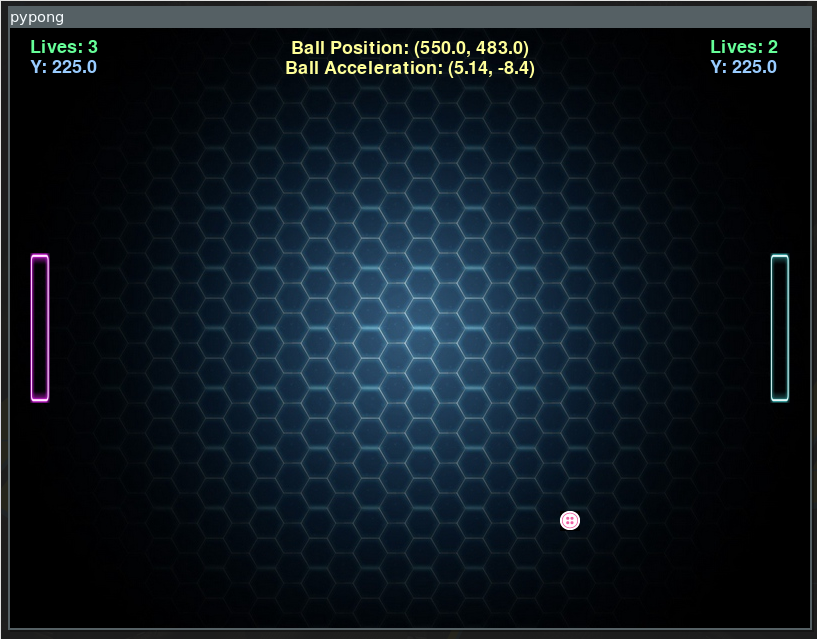
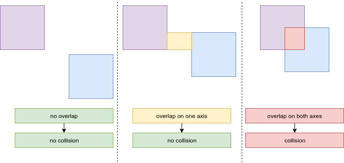

# PyPong - Learn Python and Machine Learning with Pong



Hi there, this is a learning project to teach people the basics of Python, game development and machine learning. This document is a guide that shows you step by step how to implement an object-oriented Pong clone on your own with PyGame and how to create an AI playing it.

This guide includes:

* Python basics
* Python project and dependency management with Poetry
* How to use PyCharm with virtual environments
* How to implement Pong with PyGame
* Use NumPy for vector calculations
* Use scikit-learn to predict actions

- [PyPong - Learn Python and Machine Learning with Pong](#pypong---learn-python-and-machine-learning-with-pong)
  * [Requirements](#requirements)
  * [Project setup](#project-setup)
    + [Create the project with Poetry](#create-the-project-with-poetry)
    + [Generated files overview](#generated-files-overview)
    + [First steps with Poetry](#first-steps-with-poetry)
  * [Hello world](#hello-world)
  * [Configuration](#configuration)
    + [Cleanup files](#cleanup-files)
    + [Configure sources root in PyCharm](#configure-sources-root-in-pycharm)
    + [Configure virtualenv in PyCharm](#configure-virtualenv-in-pycharm)
    + [Makefile](#makefile)
  * [PyGame](#pygame)
    + [Add PyGame depencency](#add-pygame-depencency)
    + [Hello PyGame](#hello-pygame)
    + [PyGame basics](#pygame-basics)
      - [Surface](#surface)
      - [Update display](#update-display)
      - [Draw](#draw)
      - [Coordinates](#coordinates)
      - [Time](#time)
      - [User input](#user-input)
  * [Implementing the basic game](#implementing-the-basic-game)
    + [Paddles](#paddles)
    + [Game loop](#game-loop)
    + [The ball - task](#the-ball---task)
    + [The ball - solution](#the-ball---solution)
    + [NumPy and ball acceleration](#numpy-and-ball-acceleration)
    + [Collision detection - theory and task](#collision-detection---theory-and-task)
    + [Collision detecion - solution](#collision-detecion---solution)
    + [Ball movement - task](#ball-movement---task)
    + [Ball movement - solution](#ball-movement---solution)
    + [Make it a game](#make-it-a-game)
  * [The final game](#the-final-game)
  * [Machine Learning introduction with Pong](#machine-learning-introduction-with-pong)
    + [Simple AI](#simple-ai)
    + [scikit-learn](#scikit-learn)
    + [Linear Regression and Logistic Regression](#linear-regression-and-logistic-regression)
    + [Training data](#training-data)
    + [Predict actions](#predict-actions)
    + [More theory and data visualization](#more-theory-and-data-visualization)
  * [Fin](#fin)

This repository already contains the final result. This guide will tell you step by step how to get there.

## Requirements

Ensure to have the following components installed on your system:

- Python 3.7+
- Poetry (https://poetry.eustace.io/)
- PyCharm (_Communiy Edition_)

This guide was created on a Linux environment. You should have basic knowledge about how to interact with your system in a terminal.

## Project setup

The next steps are about setting up the project and getting familiar with Poetry.

### Create the project with Poetry

Poetry is a tool for dependency management and packaging in Python. It allows you to declare the libraries your project depends on and it will manage (install/update) them for you.

We will now use it to create a new project. Just execute the following command in your terminal:

```
poetry new pypong
```

### Generated files overview

Let us have a look at the generated files without changing them:

```
.
├── pypong
│   └── __init__.py
├── pyproject.toml
├── README.rst
└── tests
    ├── __init__.py
    └── test_pypong.py
```

* `pypong/`: Contains project source
* `pyproject.toml`: Poetry config and project dependencies
* `README.rst`: Markup file for project documentation
* `tests/`: Tests for the project
* `__init__.py`: Marks directories on disk as Python packages, might contain special attributes (e.g. project version)

Or in short: our code goes into `pypong/` and dependencies will be added to `pyproject.toml`. For now this is everything we need to know.

### First steps with Poetry

Now that there is a basic Poetry project, let us get familiar with how it works. Poetry is creating a vitual Python environment on your machine for each project and takes care of interacting with that so called `virtualenv` (e.g. installing dependencies).

When you run code with Poetry it will interact with the virtual environmeent of the project and executes the code within that environment.

That way projects are isolated and your system will be kept clean.

The first step is to install the dependencies defined in the `pyproject.toml` file. Just exectue the following command in the project root dir:

```
poetry install
```

This will not only install the dependencies but also create a new file:

* `poetry.lock`: locks the installed dependency versions

From now on the install command will use the dependency versions from the lock file. Execute the following command to update the lock file and dependency versions:

```
poetry update
```

Nothing should change as we have the latest versions already.

The next step is to execute commands via Poetry in the virtual environment. Let us start with a simple command:

```
poetry run python -V
```

This will run `python -V` in your virtual environment and prints your Python version.

## Hello world

It is time to write some Python code.

Create a new Python file in the source directory:

```
touch pypong/game.py
```

Open the project in PyCharm and paste the following code in the newly created file:

```python
def main():
    print('Hello world')


if __name__ == '__main__':
    main()
```

As you can see, the code has a special element, which is: `if __name__ == '__main__':`. Whatever is part of this code block will only be executed when you run this file explicitly with the Python interpreter.

If you would get rid of the if-clause, the code would still work in our case as expected. However if someone includes this file into his project, he would also see the "Hello world" output because Python interprets all code in a file when it is imported and this might be an unexpected behavior.

The variable `__name__` only contains the text `__name__` when you run the file with Python explicitly so when importing this file, no output would appear.

That is why you should use this condition to mark the entry point to your application.

The rest of the code should be self explaining. Instead of just printing out `Hello world` to stdout, we are calling a function that will do it for us.

Give it a try and execute the code in your IDE (`Ctrl+Shift+F10`).

Keep in mind, executing your code like this will use your main Python environment and not the virtual environment managed by Poetry. This is not what we want so in the next chapter we will take care of configuring everything accordingly.

## Configuration

Before we continue with the actual project, let us do some preparation to make everything more awesome :-).

### Cleanup files

We want to keep the project structure clean so let's get rid of files and folders we don't need for this particular project.

This guide will not cover tests, even though testing is an essential part of software development. Therefore we can delete the `tests/` directory for now.

```
rm -rf tests
```

### Configure sources root in PyCharm

In PyCharm, right click on the `pypong/pypong` directory and click on `Mark Directory as -> Sources Root`.

### Configure virtualenv in PyCharm

The next step is a bit tricky. Poetry uses a virtual environment to run Python. We want PyCharm to use the exact same environment when we run code via the IDE.

The first step is to find the location of the virtual environment. Execute this command in the terminal within the root directory of your project:

```
poetry show -v
```

The first line of the output is what we are looking for, it should look something like this:

```
Using virtualenv: /home/pre/.cache/pypoetry/virtualenvs/pypong-py3.7
```

This is the location of the virtual environment.

Copy the path and switch to PyCharm. In PyCharm click on `File -> Settings` and navigate to: `Project: pypong -> Project Interpreter`. Now click on the cog on the right and choose `Add`. A new dialog will open.

In this dialog, choose `Existing environment` then click on the three dots `...` and paste the path you copied before.

Finally in this folder, navigate to `bin` and choose `python`. Then click `OK` to add the environment.

You can now close the settings window.

Run the code in your IDE again with `Ctrl+Shift+F10`. The output should look slightly different now as PyCharm uses the virtual environment to execute the code. This also means when we add dependencies with Poetry, PyCharm will also be aware of it.

### Makefile

Since we want to be flexible and also run our project in the terminal, let us create a basic Makefile to make our lives easy.

Create a file called `Makefile` in the project root directory:

```
touch Makefile
```

And paste the following content to it:

```
all:
	@echo 'see README'

run:
	poetry run python pypong/game.py

.PHONY: all run
```

You should now also be able to run the project with:

```
make run
```

The basic setup is now done and we can continue adding our first dependency.

## PyGame

We will use PyGame to create the Pong clone. This chapter will explain how to add it to our project and how PyGame works.

### Add PyGame depencency

We want to create a game. To do that we need some basic things like a game loop, handling user input, draw things in a window etc. - of course we can create all that on our own but the good thing about Python is: there is a module for everything.

Therefore let us add the first dependency: PyGame (see: https://www.pygame.org for details).

As we are using Poetry, adding a dependency is super easy, just run:

```
poetry add pygame
```

### Hello PyGame

In our `game.py` we already have a function called `main`. Replace the existing code in this function with the following snippet:

```python
    pygame.init()
    screen = pygame.display.set_mode((800, 600))
    pygame.display.set_caption("pypong")

    clock = pygame.time.Clock()

    running = True
    while running:
        clock.tick(60)
        screen.fill((0, 0, 0))

        for event in pygame.event.get():
            print(event)

        pygame.display.flip()
```

Also add the following statement on the very top of the file to import the PyGame dependency:

```python
import pygame
```

Use your IDE to format your code.

Then run your code once in your IDE and once with `make run`. You will see a nice little window with a black background, furthermore you will see the user input on stdout.

### PyGame basics

Before we continue, let us have a look at some PyGame basics. This chapter does not require any changes to your project. However read it carefully as we will apply these principles afterwards.

#### Surface

The most important part of PyGame is the `surface`. Just think of a `surface` as a blank piece of paper. You can do a lot of things with a `surface`, you can draw shapes on it, fill parts of it with color or copy images to and from it.

A `surface` can be any size and you can have as many of them as you like. One `surface` is special: the one you create with `pygame.display.set_mode()`. This display `surface` represents the screen. Whatever you do to it will appear on the users screen. You can only have one of these.

#### Update display

After adding elements on your surfaces, the display must be updated so that the outcome can be seen on the users screen. You can do this either with `pygame.display.update()` or `pygame.display.flip()`. It is recommended to use `flip` since it handles double-buffered hardware acceleration correctly.

#### Draw

With `pygame.draw` you get a set of functions to draw basic elements on a `surface`. See https://www.pygame.org/docs/ref/draw.html for an overview. Let's have a closer look at this snippet:

```python
pygame.draw.rect(
    surface,
    (255, 255, 255),
    (self.x, self.y, self.width, self.height)
)
```

This function will draw a rectangle on the given `surface`. The second parameter is the color as a tuple indicating the red, green and blue values. The third parameter is a tuple with the coordinates and size of the rectangle.

#### Coordinates

The coordinate system of each surface is a system that uses two numbers to uniquely determine the position of the points or other geometric elements. Usually those coordinates are named as `x` and `y` and are defined as a tuple. The `(0, 0)` tuple is the **top left corner** of the surface.

That means for example if an object moves down, its `y` coordinate is increasing.

#### Time

Time is a very important aspect in game development. If you move an object 10 pixels to the right in every frame, the speed of the movement depends on how many frames are rendered per second on the users machine. Because of that it is important to consider time when implementing the game loop.

PyGame has an important helper for that: the Clock. A Clock can be created with:

```python
clock = pygame.time.Clock()
```

In the game loop you can then call:

```
clock.tick(60)
```

Which will pause the loop in a way so that there are a maximum of 60 frames per second. Also it will update the clock.

Afterwards you can get the time passed since the last tick with:

```python
time_passed_ms = clock.get_time()
```

This will give you the time in milliseconds since the last tick. This value should be used in all state updates, e.g. moving objects.

**However to keep this tutorial simple, we will not use this function as this Pong clone will run at 60 fps on almost all machines anyways ;-).**

#### User input

User input is very important because every game needs to somehow react upon user input.

First of all PyGame gives you a way to react to events:

```python
for event in pygame.event.get():
    print(event)
```

An event might be mouse movement or pressing a key. However sometimes we want to not only react to a specific event but move an object as long as a key is pressed for instance.

For this kind of user interaction PyGame enables you the check the state of user input and react to this instead:

```python
if pygame.key.get_pressed()[pygame.K_w]:
    paddle1.move_up()
```

These were the basic building blocks of PyGame. Let's continue with creating the main elements of our game.

## Implementing the basic game

Enogh theory, let's jump into developing the game. Our game has some main elements: The paddles, a ball, the game loop and then some extras like an indication of who wins the game. This chapter will explain step by step how to implement these elements.

### Paddles

Okay, a black screen is boring so let's start adding the paddles. The goal is to have a rectangle on the left that can be controlled with `w` and `w` and a paddle on the right controlled with `arrow up` and `arrow down`. The paddles should not leave the window.

Python is object-oriented so let us implement the game using this paradigm.

Create a new file called `paddle.py` in the source directory and add the following code:

```python
import pygame


class Paddle:

    def __init__(self, x=20):
        self.x = x

        self.width = 20
        self.height = 150
        self.speed = 10

        # place paddle in the middle
        surface_height = pygame.display.get_surface().get_height()
        self.y = surface_height / 2 - self.height / 2

    def move_up(self):
        self.y = max(self.y - self.speed, 0)

    def move_down(self):
        surface_height = pygame.display.get_surface().get_height()
        self.y = min(self.y + self.speed, surface_height - self.height)

    def draw(self, surface):
        pygame.draw.rect(
            surface,
            (255, 255, 255),
            (self.x, self.y, self.width, self.height)
        )

```

The basic idea is that we have a `Paddle` class that can be used for the left and right paddle. The difference is the `x` position that can be set when creating an instance of a `Paddle`. The class also has methods to move the paddle up and down whereas the movemet is limited via the `min` and `max` functions that are part of the built-in Python functions.

Visit https://docs.python.org/3/library/functions.html and check the documentation for `min` and `max` to get a better understanding of those functions. Also read through the list of functions to get an overview what else Python offers.

### Game loop

Now it is time to make use of the `Paddle` class. But before we do that, let us get a basic idea of how the game loop works. Essentially it looks like this:

1. Setup objects
2. While RUNNING do
    * Handle input
    * Update state (game and elements)
    * Draw elements
    * Refresh screen

With this basic structure in mind, go back to the `game.py` file and replace the **whole file** with the following code:

```python
import pygame

from paddle import Paddle


def main():
    pygame.init()
    screen = pygame.display.set_mode((800, 600))
    pygame.display.set_caption("pypong")

    clock = pygame.time.Clock()

    paddle1 = Paddle()
    paddle2 = Paddle(760)

    running = True
    while running:
        clock.tick(60)
        screen.fill((0, 0, 0))

        # handle input
        for event in pygame.event.get():
            if event.type == pygame.KEYDOWN and event.key == pygame.K_ESCAPE:
                running = False

        if pygame.key.get_pressed()[pygame.K_w]:
            paddle1.move_up()

        if pygame.key.get_pressed()[pygame.K_s]:
            paddle1.move_down()

        if pygame.key.get_pressed()[pygame.K_UP]:
            paddle2.move_up()

        if pygame.key.get_pressed()[pygame.K_DOWN]:
            paddle2.move_down()

        # draw objects
        paddle1.draw(screen)
        paddle2.draw(screen)

        # refresh display
        pygame.display.flip()


if __name__ == '__main__':
    main()

```

Give it a try and execute the project. You should now have two paddles that can be controlled with `w` and `s` or `arrow up` and `arrow down`.

Read through the code carefully to get a basic understanding of how it interacts with the PyGame API.

### The ball - task

By now you should know how to run your project, create classes, handle user input and how to use the basic functions that PyGame offers.

Now it is your turn to create a new game object: the ball.

Create a new file `ball.py` and implement a `Ball` class, add it to your game and display it with the following requirements:

* The ball must be a **yellow** square with a side length of **20 pixels**
* Every frame it must **move 5 pixels to the left** until it reaches the **end of the screen**
* Then it switches the direction and moves **5 pixels to the right** every frame until it reaches the **end of the screen**
* Afterwards it must change its direction again and continue to move back and forth like this
* The starting position must be the **middle of the screen**

Once you are done, continue reading this document as it will have the solution in the next chapter :-).

### The ball - solution

This is one solution to the requirements mentioned before, please compare it to your solution.

It is recommended to replace your code with this solution as the following chapters are built on top of it.

The following solution uses NumPy. NumPy is the core library for scientific computing in Python. It provides a high-performance multidimensional array object, and tools for working with these arrays. See https://numpy.org/ for details.

It is absolutely not required to use NumPy in order to solve the task but we will use it so that you can learn the basics of this essential Python library.

To make the following code work, we need to add NumPy as a dependency with Poetry to our project:

```
poetry add numpy
```

Now you can integrate the following code and run the project again. Just replace the content of the files.

> ball.py

```python
import pygame
import numpy as np


class Ball:

    def __init__(self):
        self.width = 20
        self.height = 20

        # place ball in the middle
        surface_width = pygame.display.get_surface().get_width()
        surface_height = pygame.display.get_surface().get_height()

        self.position = np.array([
            surface_width / 2 - self.width / 2,
            surface_height / 2 - self.height / 2
        ])

        self.acceleration = np.array([5, 0])

    def update(self):
        if self._collision_screen_left() or self._collision_screen_right():
            self.acceleration *= -1

        self.position += self.acceleration

    def draw(self, surface):
        pygame.draw.rect(
            surface,
            (255, 255, 0),
            (self.position[0], self.position[1], self.width, self.height)
        )

    def _collision_screen_right(self):
        surface_width = pygame.display.get_surface().get_width()
        return self.position[0] + self.width >= surface_width

    def _collision_screen_left(self):
        return self.position[0] <= 0

```

> game.py

```python
import pygame

from paddle import Paddle
from ball import Ball


def main():
    pygame.init()
    screen = pygame.display.set_mode((800, 600))
    pygame.display.set_caption("pypong")

    clock = pygame.time.Clock()

    paddle1 = Paddle()
    paddle2 = Paddle(760)

    ball = Ball()

    running = True
    while running:
        clock.tick(60)
        screen.fill((0, 0, 0))

        # handle input
        for event in pygame.event.get():
            if event.type == pygame.KEYDOWN and event.key == pygame.K_ESCAPE:
                running = False

        if pygame.key.get_pressed()[pygame.K_w]:
            paddle1.move_up()

        if pygame.key.get_pressed()[pygame.K_s]:
            paddle1.move_down()

        if pygame.key.get_pressed()[pygame.K_UP]:
            paddle2.move_up()

        if pygame.key.get_pressed()[pygame.K_DOWN]:
            paddle2.move_down()

        # update state
        ball.update()

        # draw objects
        paddle1.draw(screen)
        paddle2.draw(screen)
        ball.draw(screen)

        # refresh display
        pygame.display.flip()


if __name__ == '__main__':
    main()

```

### NumPy and ball acceleration

Okay, now that you applied the solution of the previous chapter, you might have some questions about NumPy.

In Python, we have lists. But in NumPy we have arrays. They are like lists but better because they are faster, have more possibilities to interact with and take less memory.

A NumPy array is a table of elements (usually numbers), all of the same type, indexed by a tuple of positive integers. The number of dimensions is the rank of the array. The shape of an array is a tuple of integers giving the size of the array along each dimension.

A NumPy array can be instantiated from nested Python lists, and elements can be accessed using square brackets:

```python
self.position = np.array([
    surface_width / 2 - self.width / 2,
    surface_height / 2 - self.height / 2
])

# ...

return self.position[0] + self.width >= surface_width
```

Basic mathematical functions operate elementwise on arrays, and are available both as operator overloads and as functions in the NumPy module.

That is why we can use a NumPy array as an acceleration vector and add it to our position vector simply with:

```python
self.position += self.acceleration
```

Which is nothing but vector addition.

Also the direction change when there is a collision with a screen boundary is simply done with:

```python
self.acceleration *= -1
```

Which is nothing but a vector scalar multiplicaton with -1 which reverses its direction.

So as you can see, NumPy arrays are really useful and makes things simple. It will also help us later then we need more advanced movement of the ball object.

### Collision detection - theory and task

We now have two paddles and a ball. The ball knows when it hits the wall since it knows its own position and can access the screen width via PyGame.

Now we need to detect the collision between the paddles and the ball. This chapter will explain the theory behind it. Your task will then be to implement this in our game class as it manages the paddle and ball instances.

But before we start with the fun part, let's jump into theory :-).

We will use AABB Collision Detection or **Axis-Aligned Bounding Box** collision detection as it stands for is the simplest form, or one of the simplest forms of collision detection that you can implement in a 2D game.

AABB is a rectangular collision shape and only works if the shapes are axis-aligned. Being axis-aligned means the rectangular box is not rotated and its edges are parallel to the base axes of the surface. So perfect for our Pong clone :-).

So how do we determine if there is a collision? A collision occurs when two shapes enter each others regions e.g. the first rectangle is in some way inside the second retangle. For AABBs this is quite easy to determine due to the fact that they're aligned to the scenes axes.

We check for each axis if the two object edges on that axis overlap. So basically we check if the horizontal edges overlap and if the vertical edges overlap of both objects. If both the horizontal and vertical edges overlap we have a collision.

Or explained in a more visual way:



The following pseudo code shows how it can be implemented:

```
collision_x = a.x + a.width >= b.x AND b.x + b.width >= a.x
collision_y = a.y + a.height >= b.y AND b.y + b.height >= a.y

collision = collision_x AND collision_y
```

Your task is to implement this collision detection in one or multiple functions in the `game.py` file.

The possible collisions are between `paddle1` and `ball` as well as `paddle2` and `ball`.

In addition use the built-in function `print` to print out a text to stdout whenever there is a collision which also indicates which objects collided.

Continue with the next chapter once you are done.

### Collision detecion - solution

This is one solution to the requirements mentioned before, please compare it to your solution.

It is recommended to replace your code with this solution as the following chapters are built on top of it.

> game.py

```python
import pygame

from paddle import Paddle
from ball import Ball


def main():
    pygame.init()
    screen = pygame.display.set_mode((800, 600))
    pygame.display.set_caption("pypong")

    clock = pygame.time.Clock()

    paddle1 = Paddle()
    paddle2 = Paddle(760)

    ball = Ball()

    running = True
    while running:
        clock.tick(60)
        screen.fill((0, 0, 0))

        # handle input
        for event in pygame.event.get():
            if event.type == pygame.KEYDOWN and event.key == pygame.K_ESCAPE:
                running = False

        if pygame.key.get_pressed()[pygame.K_w]:
            paddle1.move_up()

        if pygame.key.get_pressed()[pygame.K_s]:
            paddle1.move_down()

        if pygame.key.get_pressed()[pygame.K_UP]:
            paddle2.move_up()

        if pygame.key.get_pressed()[pygame.K_DOWN]:
            paddle2.move_down()

        # update state
        ball.update()

        if collision(paddle1, ball):
            print("collision between paddle1 and ball")

        if collision(paddle2, ball):
            print("collision between paddle2 and ball")

        # draw objects
        paddle1.draw(screen)
        paddle2.draw(screen)
        ball.draw(screen)

        # refresh display
        pygame.display.flip()


def collision(paddle, ball):
    return aabb_collision(
        paddle.x,
        paddle.y,
        paddle.width,
        paddle.height,
        ball.position[0],
        ball.position[1],
        ball.width,
        ball.height
    )


def aabb_collision(a_x, a_y, a_width, a_height, b_x, b_y, b_width, b_height):
    collision_x = a_x + a_width >= b_x and b_x + b_width >= a_x
    collision_y = a_y + a_height >= b_y and b_y + b_height >= a_y

    return collision_x and collision_y


if __name__ == '__main__':
    main()

```

### Ball movement - task

We are now able to detect if the ball collides with the left edge, the right edge or one of the paddles.

Now we need to adjust the movement of the ball and we must also detect and react to collisions with the top and bottom edges of the surface.

Your task now is to implement the correct behavior of the ball object based on the following rules:

* **(1)** When the ball hits the left or right border, the angle of reflection is equal to the angle of incidence.
* **(2)** When the ball hits the top or bottom border, the angle of reflection is equal to the angle of incidence.
* **(3)** When the ball hits the paddle, the angle of reflection will depend on how far the ball is away from the center of the paddle when hitting it.

For the implementation, consider the following requirements:

* When a collision is detected in `game.py` call a function in the `Ball` class instance that changes the movement accordingly.
* Try to use NumPy functionality for the math part.
* Try different versions of how much impact the distance to the center of the paddle has.

Continue when you have a ball that bounces from all edges and the paddles according to the rules explained previously.

The following overview visualizes the cases with some examples:


### Ball movement - solution

This is one solution to the requirements mentioned before, please compare it to your solution.

It is recommended to replace your code with this solution as the following chapters are built on top of it.

> ball.py
```python
import pygame
import numpy as np


class Ball:

    def __init__(self):
        self.width = 20
        self.height = 20

        # place ball in the middle
        surface_width = pygame.display.get_surface().get_width()
        surface_height = pygame.display.get_surface().get_height()

        self.position = np.array([
            surface_width / 2 - self.width / 2,
            surface_height / 2 - self.height / 2
        ])

        self.acceleration = np.array([5, 1])

    def update(self):
        if self._collision_screen_left() or self._collision_screen_right():
            self.acceleration = np.multiply(self.acceleration, np.array([-1, 1]))

        if self._collision_screen_top() or self._collision_screen_bottom():
            self.acceleration = np.multiply(self.acceleration, np.array([1, -1]))

        self.position += self.acceleration

    def accelerate(self, factor):
        self.acceleration = np.multiply(self.acceleration, np.array([-1, 1]))
        self.acceleration[1] = factor

    def draw(self, surface):
        pygame.draw.rect(
            surface,
            (255, 255, 0),
            (self.position[0], self.position[1], self.width, self.height)
        )

    def _collision_screen_left(self):
        return self.position[0] <= 0

    def _collision_screen_right(self):
        surface_width = pygame.display.get_surface().get_width()
        return self.position[0] + self.width >= surface_width

    def _collision_screen_top(self):
        return self.position[1] <= 0

    def _collision_screen_bottom(self):
        surface_height = pygame.display.get_surface().get_height()
        return self.position[1] + self.height >= surface_height

```

> game.py

```python
import pygame

from paddle import Paddle
from ball import Ball


def main():
    pygame.init()
    screen = pygame.display.set_mode((800, 600))
    pygame.display.set_caption("pypong")

    clock = pygame.time.Clock()

    paddle1 = Paddle()
    paddle2 = Paddle(760)

    ball = Ball()

    running = True
    while running:
        clock.tick(60)
        screen.fill((0, 0, 0))

        # handle input
        for event in pygame.event.get():
            if event.type == pygame.KEYDOWN and event.key == pygame.K_ESCAPE:
                running = False

        if pygame.key.get_pressed()[pygame.K_w]:
            paddle1.move_up()

        if pygame.key.get_pressed()[pygame.K_s]:
            paddle1.move_down()

        if pygame.key.get_pressed()[pygame.K_UP]:
            paddle2.move_up()

        if pygame.key.get_pressed()[pygame.K_DOWN]:
            paddle2.move_down()

        # update state
        ball.update()

        if collision(paddle1, ball):
            ball.accelerate(acc_factor(paddle1, ball))

        if collision(paddle2, ball):
            ball.accelerate(acc_factor(paddle2, ball))

        # draw objects
        paddle1.draw(screen)
        paddle2.draw(screen)
        ball.draw(screen)

        # refresh display
        pygame.display.flip()


def acc_factor(paddle, ball):
    ball_center = ball.position[1] + ball.height / 2
    paddle_center = paddle.y + paddle.height / 2

    distance = ball_center - paddle_center

    return distance / 10


def collision(paddle, ball):
    return aabb_collision(
        paddle.x,
        paddle.y,
        paddle.width,
        paddle.height,
        ball.position[0],
        ball.position[1],
        ball.width,
        ball.height
    )


def aabb_collision(a_x, a_y, a_width, a_height, b_x, b_y, b_width, b_height):
    collision_x = a_x + a_width >= b_x and b_x + b_width >= a_x
    collision_y = a_y + a_height >= b_y and b_y + b_height >= a_y

    return collision_x and collision_y


if __name__ == '__main__':
    main()

```

### Make it a game

Now that we have the basic elements, it is time to make a game out of this prototype.

This is where you should become creative and find your own way of how to add the missing elements. The goal at the end is to have the following features:

* Paddles / players should have lives and if there is a collision between the ball and a left or right border, the respective player should loose a live.
* Implement a new GUI class that is able to show the lives of the players as text in the game. To give you some inspiration, this is how it might look like:

```python
import pygame


class PaddleGui:

    def __init__(self, paddle, x=20):
        self.paddle = paddle
        self.x = x
        self.font = pygame.font.Font('freesansbold.ttf', 18)

    def draw(self, surface):
        text = self.font.render(
            'Lives: {}'.format(self.paddle.lives),
            True,
            (102, 255, 153)
        )

        surface.blit(text, (self.x, 10))

```

* The code in `game.py` should be turned into a `Game` class.
* Using a specific key (e.g. `r`), the players should be able to reset the game.
* When a player reaches 0 lives, the game should end and show a winner.
* Add an optional computer player.

## The final game

Check out the code in this repository to see the final result.

## Machine Learning introduction with Pong

Python is often used for machine learning purposes. Even though this project does not really require any kind of machine learning to create an artifical player, I would still like to take the chance and give you a short introduction to machine learning using this project.

Generally speaking machine learning is about building programs with tunable parameters that are adjusted automatically to improve their behavior by adapting to previously seen data.

The next chapters are meant to explain the basics of machine learning with the PyPong project as an example. It will not cover a step by step implementation guide as before but all code can be found in this repository.

### Simple AI

The following snippet shows how a simple AI might look like without any machine learning applied:

> computer.py

```python
class Computer:

    def move(self, paddle, ball):
        paddle_center = paddle.y + paddle.height / 2
        ball_center = ball.position[1] + ball.height / 2

        distance = abs(paddle_center - ball_center)

        if distance > 20 and paddle_center > ball_center:
            paddle.move_up()

        if distance > 20 and paddle_center < ball_center:
            paddle.move_down()

```

As you can see, there is no need for machine learning as the problem is simple enough to hardcode the behavior:

* If the center of the paddle is below the center of the ball, move the paddle up.
* If the center of the paddle is above the center of the ball, move the paddle down.

That is already working fine. However now imagine that it is not that trivial to see this behavior right away. You just have some sample data and know how a player should behave in those situations.

Machine learning can now be used to learn from that data and predict future actions based on observations. The next chapters will explain the implementation that you can see in `computer_sklearn.py`.

### scikit-learn

Python has lots of modules connected to the topic of AI and machine learning, however scikit-learn is one of the most famous machine learning libraries and offers you a lot of different options:

* Classification: Identifying to which category an object belongs to.
* Regression: Predicting a continuous-valued attribute associated with an object.
* Clustering: Automatic grouping of similar objects into sets.
* Dimensionality reduction: Reducing the number of random variables to consider.
* Model selection: Comparing, validating and choosing parameters and models.
* Preprocessing: Feature extraction and normalization.

### Linear Regression and Logistic Regression

Linear regression models are used to show or predict the relationship between variables or factors.

In our case, we have the y position of the paddle center and the y position of the ball center as variables and we want to know if the paddle should move up or down.

Logistic regression is like linear regression but used when the dependent variable is binary in nature. That means when our prediction can only be 0 or 1, like in our case!

### Training data

What we are about to do is supervised learning. That means we have training data that we use to train the model so that it can predict future values.

Training data in our case means: we have two dimensional tuples that represent these features:

* Center of the paddle on the Y axis.
* Center of the ball on the Y axis.

The other part of the training data are the target values, so did the paddle move up (0) or down (1).

Using `scikit-learn` we can train a Logistic Regression model like this:

```python
from sklearn.linear_model import LogisticRegression


class Computer:

    def __init__(self):
        # features: y position of paddle center, y position of ball center
        training_data = [[50, 150], [400, 200], [100, 110], [210, 190]]

        # 0 = move up, 1 = move down
        target_values = [1, 0, 1, 0]

        self.model = LogisticRegression()
        self.model.fit(training_data, target_values)

```

### Predict actions

Now that we have a trained model, we can use it to predict actions based on new observations:

```python
    def move(self, paddle, ball):
        paddle_center = paddle.y + paddle.height / 2
        ball_center = ball.position[1] + ball.height / 2

        prediction = self.model.predict([[paddle_center, ball_center]])
        print('input: [{}, {}], prediction: {}'.format(paddle_center, ball_center, prediction))

        if prediction == 0:
            paddle.move_up()

        if prediction == 1:
            paddle.move_down()

```

The resulting AI (`computer_sklearn.py`) is acting similar to the hardcoded behavior in `computer.py`.

### More theory and data visualization

Even though the AI is already working, let us have a closer look to get a better understanding of what happens under the hood.

Short recap: Our training data has two features: the y position of the paddle center and the y position of the ball center. The target value is either 0 or 1 whereas 0 means: move the paddle up and 1 means: move the paddle down.

We trained a logistic regression model so that it is able to predict the action (0 or 1) for new input tuples (i.e. paddle and ball positions).

In order to demystify this process, I added a simple visualization. If you want to try it on your own, just go to `computer_sklearn.py` and uncomment the following line:

```python
self._visualize_data_relationship()
```

When you now start the application, you will see the following graph:


These are 1000 predictions of the model for random paddle and ball positions. Blue dots indicate that the model predicted to move the paddle up and magenta dots indicate that the model predicted to move the paddle down.

As you can see, our model found a way to clearly separate those two clusters: whenever the y position of the ball position is bigger than the y position of the paddle, the model predicts: move up. Otherwise it predicts: move down.

Or in other words, the model found a function, that is giving us this result.

However keep in mind: we are doing a logistic regression, that means we either get 0 or 1 as an output. This is usually done by applying a sigmoid function to the output of the underlying function of the model.

Have a look at the following graph to get an idea what the effect of that function is:


As you can see, the sigmoid function returns 0 for smaller values and 1 for higher values. That means our model found a function that behaves in a way so that the result is low when the position value of the paddle is lower than the position value of the ball. 

Likewise this function returns a high value, when the position value of the paddle is higher than the position value of the ball.

The good thing is: we can even get this function from our model to get a better understanding how it looks like.

To do this, we can just use the following snippet after training our model:

```python
self.model = LogisticRegression()
self.model.fit(training_data, target_values)

# prediction function used for linear regression
print('f(paddle_center, ball_center) = {} + {} * paddle_center + {} * ball_center'.format(
    round(self.model.intercept_[0], 4),
    round(self.model.coef_[0][0], 4),
    round(self.model.coef_[0][1], 4)
))
```

Which will give us the following output:

```python
f(paddle_center, ball_center) = 0.0124 + -0.2783 * paddle_center + 0.2853 * ball_center
```

This is a simple function and we can even try it on our own with some data.

Let us assume our paddle is at position 10 and the ball is at position 200. That means our paddle is above the ball and to get it, we need to move down. So what we expect is that the function returns a high value so that the sigmoid function turns it into a 1 which means: move down.

```
paddle_center = 10
ball_center = 200

0.0124 - 0.2783 * 10 + 0.2853 * 200 = 54.2894
sigmoid(54.2894) = 1 = down
```

Now let us turn it around. Our paddle is at position 400 and the ball is at position 30. So we would need to move up.

```
paddle_center = 400
ball_center = 30

0.0124 - 0.2783 * 400 + 0.2853 * 30 = -102.7486
sigmoid(-102.7486) = 0 = up
```

As you can see: it works and this is what our model is doing all day long when we play the game ;-).

## Fin

Using machine learning in this case does not really make sense but it is a good and simple example to understand the basics and how to implement a simple model.

You can switch between the hardcoded and machine learning AI by just changing the import statement in `game.py`.

I hope this guide motivates you to look deeper into this topic. A good start is to go for another game and start from the scratch: implement the game logic and then use a machine learning model to create an AI.

To get some more inspiration: check out my FlapAI project on Github which is basically a Flappy Bird clone with JavaScript combined with an AI implementation.

The AI combines Neural Networks using TensorFlow.js (https://www.tensorflow.org/js) with evolutionary algorithms to evolve populations of AI players using genetic operators.

See: https://github.com/prenomenon/flapai

Have fun and good luck :-).
